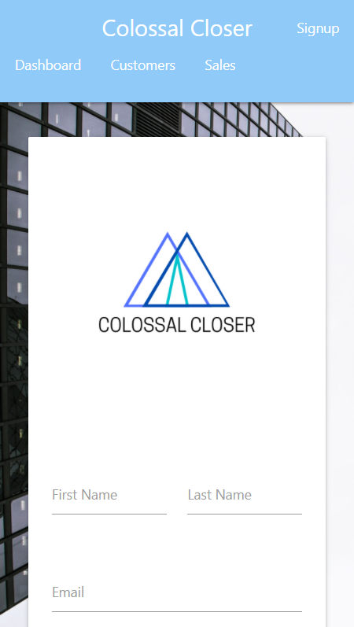
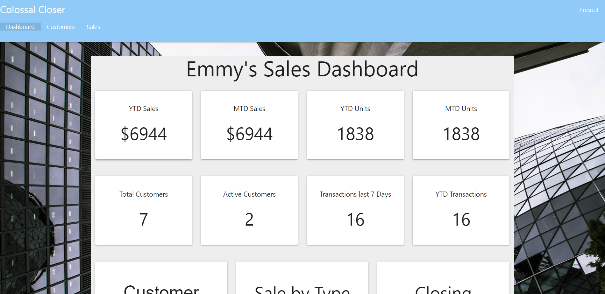
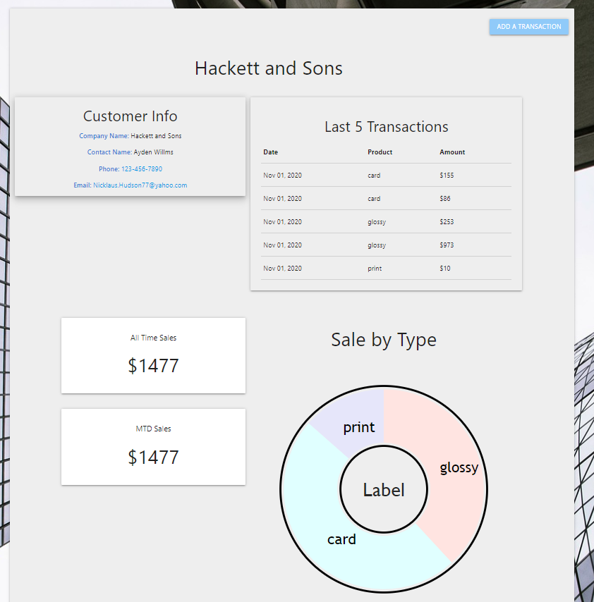

# Colossal Closer

## Table of Contents

* [Description](#description)

* [Preview](#preview)

* [Usage](#usage)

* [Contributers](#contributers)

* [Way Ahead](#way-ahead)

* [Questions](#questions)

## Description

* Colossal Closer is a Customer Relationship Management application that allows a company to track employee-customer interactions and provide relevant data for the company to view progress.  Designed for the mobile salesman, this application is responsive on all types of devices.  The deep, dark offices of your customer has no service or WiFi?  No worries, Colossal Closer is a downloadable progressive web application that even works offline.  Colossal Closer makes tracking simple for the salesman on the move and the management team back home.

* You can view the deployed site at [https://colossal-closer.herokuapp.com/](https://colossal-closer.herokuapp.com/).

## Preview

* Signup Page

* Main Dashboard

* Employee's Customer List

* Single Customer Details

## Usage

* For development, after installing all dependencies, you need to create a `.env` file within the `server` directory to store `JWT_SECRET="<put anything here>"` in order to hash the employee's password within `server/utils/auth.js`.  Run `npm start` to begin running the application.  

* To sample a deployed employee, use email: "alex@colossalcloser.com" and password: "password123".

## Contributers

This project was designed by a team consisting of four engineers.  [Neil Dino](https://github.com/NGDino) and [Marlon Guandique](https://github.com/chulopapi) built the front-end, and [Nathan McAnally](https://github.com/nmcanall) and [Brian Presta](https://github.com/brian-presta) designed the back-end. 

## Way Ahead

There are a few pending improvements to this page:

* Creation of administrative account, allowing managers to view specific employee details.

* Allow the administrator to create and validate employee emails, ensuring only valid employees register for the site.

* Map displaying location of all customers and businesses.

* Ability to add different types of products to the product list.

* Feature that searches for cetain customers, transactions, or products, and displays the querried data in the requested order.

## Questions

If you have questions about this project, or if you would like to contribute, visit our repo at [GitHub](https://github.com/nmcanall/Colossal Closer) or contact Nathan directly at <nmcanall@citadel.edu>.